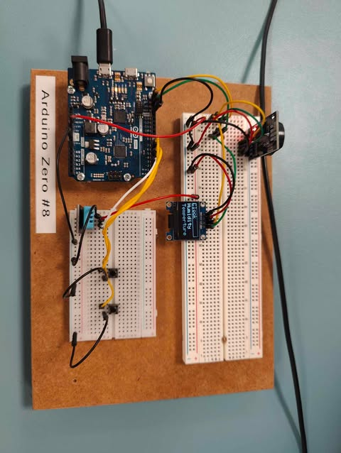

# Arduino

## Table of Contents
1. [Om projektet](#om-projektet)
2. [Funktionalitet](#funktionalitet)
3. [Libraries](#libraries)
4. [Sprog](#sprog)
5. [Hardware](#hardware)
6. [Mappe Struktur](#mappestruktur)
7. [Board](#board)
   - [Boardet](#boardet)
   - [Port Table](#port-table)
8. [Kontakt](#kontakt)
9. [Licens](#licens)

---

## Om projektet

Dette projekt er en del af et intelligent IoT-styret hus, hvor der implementeres en Real Time Clock (RTC) med visning af tid og dato samt måling og visning af temperatur og luftfugtighed. Projektet kombinerer forskellige sensorer og et display for at give brugeren relevante informationer i realtid.

En central del af projektet er en brugervenlig menu, hvor man kan vælge mellem at vise enten tid/dato eller temperatur eller luftfugtighed. Menuen kan betjenes med to simple knapper. En til at gå i gennem menuen og en til at vælge det ønskede menupunkt.

Tid og dato vises i formatet med to cifre (f.eks. 07:06:05), og hele systemet er struktureret i flere filer med brug af header-filer og dokumentation for at sikre vedligeholdelse og genanvendelighed.

---

## Funktionalitet

- **OLED-skærm**
- **Målinger**
    - Temperatur
    - Luftfugtighed
- **Udlæsninger**
    - Tid
    - Dato
    - Temperatur
    - Luftfugtighed
- **Knapper**
    - Til at bladre gennem menu
    - Til at vælge et punkt i menuen

---

## Libraries

- [**RTCLib V2.1.4**](https://docs.arduino.cc/libraries/rtclib/#Compatibility)
- [**SPI Built-In**](https://docs.arduino.cc/language-reference/en/functions/communication/SPI/)
- [**Wire Built-In**](https://docs.arduino.cc/language-reference/en/functions/communication/wire/)
- [**Adafruit_GFX V1.12.1**](https://docs.arduino.cc/libraries/adafruit-gfx-library/)
- [**Adafruit_SSD1306 V2.5.14**](https://docs.arduino.cc/libraries/adafruit-ssd1306/)
- [**DHT V1.4.6**](https://projecthub.arduino.cc/arcaegecengiz/using-dht11-12f621)
- [**EasyButtons V2.0.3**](https://docs.arduino.cc/libraries/easybutton/)

---

## Sprog
- C++
---
## Hardware
- Arduino Zero
- Adafruit SSD1306
- RTC_DS3231
- DHT11
- 2x Pushbuttons
---

## Mappestruktur

```plaintext
/src
├── main.ino
├── time.h / time.cpp
├── temp.h / temp.cpp
├── humidity.h / humidity.cpp
```
---
## Board

Nedenfor ses både mit board og en port tabel, der illustrerer boardets setup:

### Board



### Port Table

|    SCL     |    SDA     |VCC/V3.3    |    Ground    |      6    |      5    |      2    |
|------------|------------|------------|--------------|-----------|-----------|-----------|
|Yellow wire |Green Wire  |Red Wire    |Black Wire    |Yellow Wire|Yellow Wire|White Wire |
|    RTC     |RTC         |     RTC    |Every Componet| Button 1  |Button 2   | DHT       |
|Oled SSD1306|Oled SSD1306|Oled SSD1306|              |           |           |           |
|            |            |     DHT    |              |           |           |           |

## Kontakt

Discord: `synx_eu`
> E-mail support er ikke tilgængelig.

---

## Licens

MIT-licens. Se [LICENSE](LICENSE).
